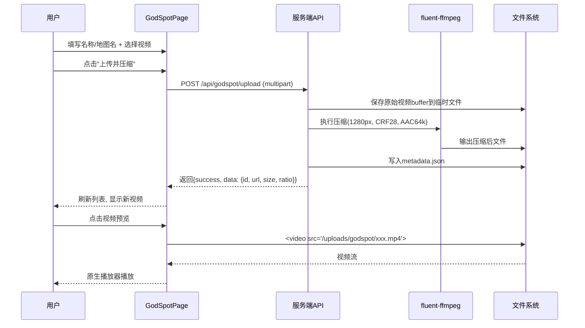

## 用户需求

在现有面板网站的左侧导航栏中新增一个"神人点位"按钮，点击后跳转至独立管理页面。

## 核心功能

1. **导航入口**：左侧导航栏新增"神人点位"按钮（Crosshair 图标），点击切换到独立页面
2. **视频上传与自动压缩**：支持选择本地视频文件上传，上传后服务端自动使用 ffmpeg 压缩（H.264, 720p, CRF28），显著减小文件体积
3. **快速视频预览**：上传完成后直接在页面内点击播放预览
4. **自定义命名**：用户可为每个视频设置自定义显示名称
5. **关联地图名称**：用户可为每个视频关联一个地图名称
6. **视频列表管理**：以列表形式展示所有已上传视频，支持删除操作
7. **独立页面**：整个功能在独立页面实现，非弹窗或模态框，利用 React.lazy 懒加载

## 技术栈选择

| 层级 | 技术 | 说明 |
| --- | --- | --- |
| 前端框架 | React 19 + TypeScript | 沿用现有技术栈 |
| 样式 | Tailwind CSS 4 + Framer Motion | 沿用现有样式系统与动效 |
| 图标 | lucide-react（Crosshair 图标） | 导航按钮图标 |
| 后端 | Express 4 + TypeScript | 沿用现有服务端框架 |
| 文件解析 | busboy | 沿用社区上传的 multipart 解析方案 |
| 视频压缩 | fluent-ffmpeg + 系统 ffmpeg | 服务端压缩（H.264 CRF28, 720p, AAC 64kbps） |
| 数据持久化 | JSON 文件（atomicJson） | 沿用现有方案，存入 runtime/godspot/metadata.json |
| 视频文件存储 | 本地文件系统 | 存入 runtime/godspot/videos/ 目录 |
| 认证 | requireAuth 中间件 | 上传/删除操作需登录 |


## 实现方案

### 整体策略

沿用项目现有 SPA 导航模式（activeTab + localStorage）和文件上传模式（busboy 解析 multipart + 服务端处理），新增完整管理页面，React.lazy 懒加载。

### 视频压缩方案

采用服务端 ffmpeg 压缩，流程：

1. 前端 multipart/form-data 上传文件 + 元数据（自定义名称、地图名）
2. 服务端 busboy 解析原始视频 buffer
3. fluent-ffmpeg 压缩处理：

- 视频编码：libx264，广泛兼容
- 分辨率：max 1280px 宽（720p），保持宽高比
- CRF 值：28（平衡质量与体积）
- 预设：medium
- 音频编码：AAC 64kbps

4. 压缩后文件保存至 runtime/godspot/videos/
5. 元数据保存至 runtime/godspot/metadata.json
6. 返回上传结果包含原始大小 / 压缩后大小 / 压缩比

### 关键设计决策

- **服务端压缩**：避免浏览器 WASM 下载开销和兼容性问题
- **静态文件服务**：express.static 提供视频 HTTP 访问，实现原生快速预览
- **HTML5 Video**：直接播放压缩后视频，浏览器原生支持
- **新增依赖**：fluent-ffmpeg（npm）+ ffmpeg（apt 安装）

## 架构设计

### 系统架构图

```mermaid
flowchart TD
    subgraph 前端
        A[Sidebar.tsx] -->|点击导航| B[App.tsx activeTab='godspot']
        B -->|React.lazy| C[GodSpotPage.tsx]
        C -->|fetch| D[/api/godspot/*]
    end

    subgraph 服务端
        D --> E[GET / - 列表]
        D --> F[POST /upload - 上传+压缩]
        D --> G[DELETE /:id - 删除]
        F --> H[busboy解析]
        H --> I[fluent-ffmpeg压缩]
        I --> J[存储压缩视频]
        F --> K[写入元数据JSON]
        G --> J
        G --> K
    end

    subgraph 持久化
        J --> L[runtime/godspot/videos/]
        K --> M[runtime/godspot/metadata.json]
    end

    C -->|视频URL| N[express.static]
    N --> L
```

### 数据流



## 实现要点

### 性能

- 视频压缩异步执行，上传响应返回压缩进度状态
- 列表接口只返回元数据，不包含文件流
- 视频预览通过 express.static 直接提供，零服务器 CPU 开销
- 移动端预览通过原生 `<video>` 利用设备硬件解码

### 日志

- 复用 server/lib/logger.ts 的 logger 实例
- 记录上传开始、压缩进度（百分比）、完成/失败事件
- 上传失败的原始文件自动清理，避免磁盘泄漏

### 爆炸半径控制

- 新增路由和数据存储完全独立于现有功能
- 仅修改 Sidebar.tsx、App.tsx、server.ts 三个现有文件
- Dockerfile 在 apt-get 列表追加 ffmpeg
- 不更改任何现有 API、组件逻辑或数据结构
- 新文件按项目惯例放在对应模块目录

## 目录结构

```
d:/Desktop/网站2/
├── src/
│   ├── pages/
│   │   └── GodSpotPage.tsx       [NEW] 神人点位管理页面，包含上传区、表单、列表、预览
│   ├── components/
│   │   └── Sidebar.tsx            [MODIFY] 新增"神人点位"导航按钮
│   └── App.tsx                    [MODIFY] 新增 activeTab='godspot' 路由与懒加载
├── server/
│   ├── routes/
│   │   └── godspot.ts             [NEW] API 路由：GET /, POST /upload, DELETE /:id
│   └── lib/
│       └── godspotStore.ts        [NEW] 元数据 Read/Write + fluent-ffmpeg 封装 + 文件管理
├── server.ts                      [MODIFY] 注册 godspot 路由 + 静态文件服务
├── package.json                   [MODIFY] 新增 fluent-ffmpeg 依赖，版本 v1.3.0
├── Dockerfile                     [MODIFY] 安装 ffmpeg 系统包
└── docs/
    └── release-notes.md           [MODIFY] 新增 v1.3.0 版本说明
```

## 设计风格

采用与项目现有风格一致的最小化功能型设计，使用 Tailwind CSS zinc 色调色系。页面布局分为三大区块：

1. **页面头部**：包含返回首页按钮（← 箭头），页面标题"神人点位管理"，和一行描述文字

2. **上传区域**：桌面端左右两列布局。左侧为拖拽/点击上传区（灰色虚线边框、上传图标、提示文字）；右侧为信息表单（自定义文件名输入框、地图名输入框、"上传并压缩"按钮）。上传中显示进度条动画和压缩状态提示。

3. **视频列表**：卡片式列表，每张卡片包含播放预览按钮（▶）、自定义文件名、关联地图名、原始/压缩后文件大小、压缩率、创建时间、删除操作按钮。点击预览打开内嵌 HTML5 视频播放器。

### 交互细节

- 上传区支持拖拽文件和点击选择两种方式
- 选择文件后立即显示文件名和文件大小
- 上传中显示进度条（上传进度 + 压缩进度两阶段）
- 视频预览在当前页面展开播放，不跳转新页面
- 删除有确认对话框（复用现有交互模式）
- 完整支持亮色/暗色模式（继承项目现有主题系统）

## Agent Extensions

### SubAgent

- **code-explorer**
- Purpose: 在实施阶段需要再次探索代码以确保上传、压缩、路由模式准确对齐现有实现
- Expected outcome: 确保 fluent-ffmpeg 调用模式和 busboy 文件解析完全复用现有社区上传的准确代码，避免模式偏离